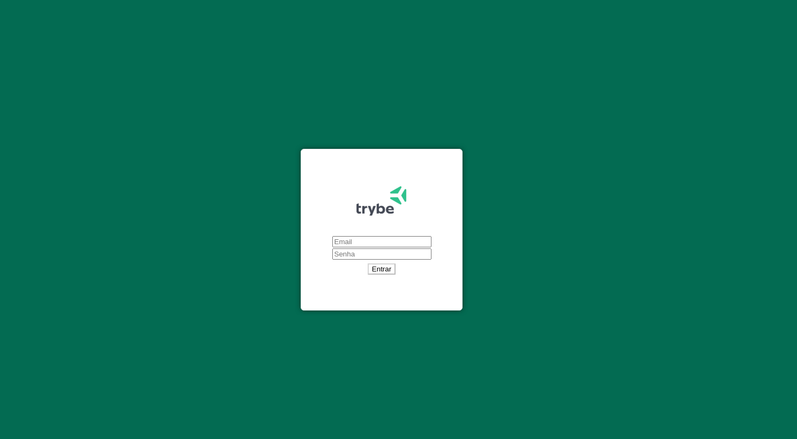

# Projeto trybewallet

## [Clique aqui](https://trybewallet-steel.vercel.app/carteira) para acessar o App

## Descrição
este app é uma carteira virtual, ela calcula seus gastos e regista suas compras de certa forma pode funcionar como controle de gastos.

## Habilidades
Neste projeto, mostro que sou capaz de:

  * Criar um store Redux em aplicações React

  * Criar reducers no Redux em aplicações React

  * Criar actions no Redux em aplicações React

  * Criar dispatchers no Redux em aplicações React

  * Conectar Redux aos componentes React

  * Criar actions assíncronas na sua aplicação React que faz uso de Redux.

## Tecnologias Utilizadas:
|HTML|CSS|JavaScript|ReactJS|
|-|-|-|-|
|||||
|Sintaxe JSX|Utilizado na estilização das páginas e dos componentes com styled components|Aplicação das funcionalidades com o Framework React|Recursos Utilizados: Function Components, React Router DOM, React Hooks|
___

## Melhorias:

- desenvolver o css deixando mais bonito;

- organizar para deixar mais didatico;

